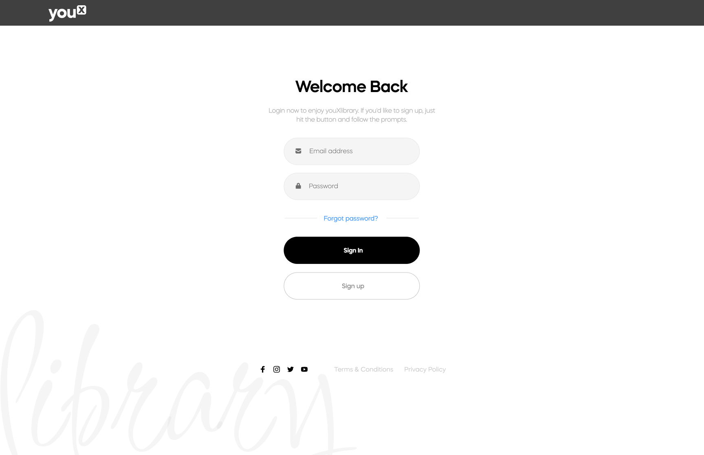
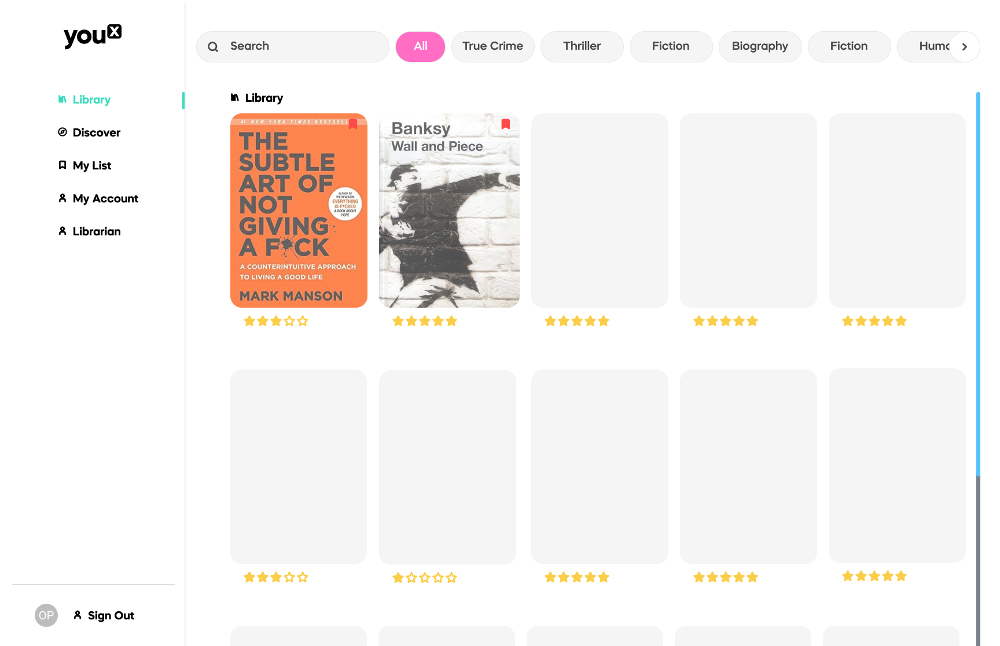
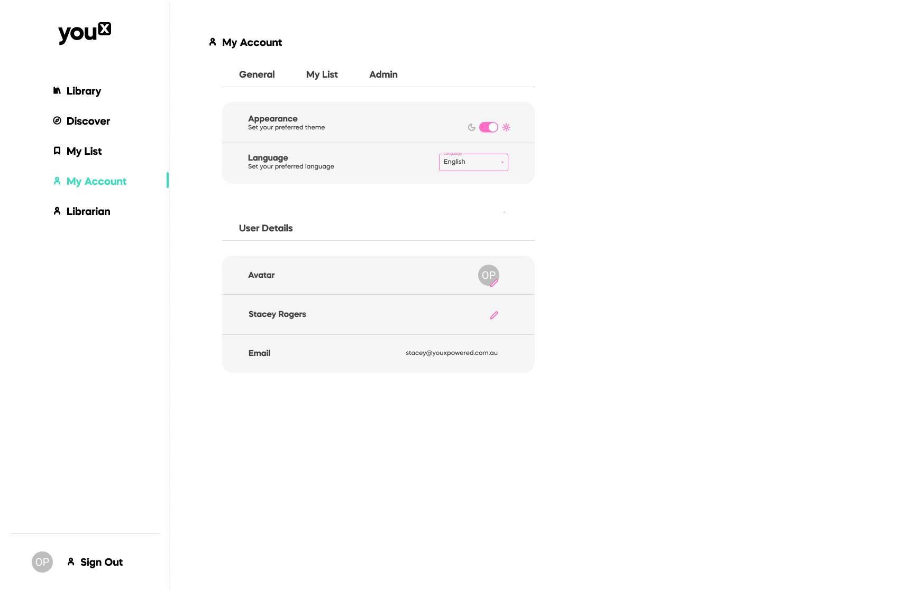

# youXlibrary

## Table of Contents

- [Technologies Used](#technologies-used)
- [Description](#description)
- [Design](#design-mockups)
- [User Story](#user-story)
- [Future Development](#future-development)
- [License](#license)
- [Authors](#authors)
- [GitHub Repository](#github-repository)
- [Deployed Application](#deployed-application)

## Technologies Used:
* React + Vite
* Mongo DB
* Material UI
* Nodemon
* Javascript
* Node.js
* Mongoose
* Nodemon

## Description
Welcome to the Office Library, your virtual gateway to our workplace's rich repository of knowledge and entertainment. This intuitive web application is designed to foster a culture of learning and sharing within our office community. Here, employees can effortlessly browse, reserve, and borrow from an extensive collection of books tailored to professional development and personal interests.

## Design Mockups
 
 
 

## User Story

* As a USER I want to login, if I cannot login;
* As a USER I want to sign up
* As a USER I want to sign out
* As a USER I want to see what books are in the library

## Future Development

* As a USER I want to be able to ADD a book to the library
* As a USER I want to see what previous books I have read
* As an admin USER I want to print a custom QR code, so I can scan a book in and out of the library
* As a USER I want a light and dark mode
* As a USER I want to request a book
* As an admin USER I want an admin panel

## License
The application is covered under the following license: MIT

## Authors
Stacey Rogers

## GitHub Repository
View GitHub Repository [here]

## Deployed Application
View deployed application [here](https://library-01-2.onrender.com/)

